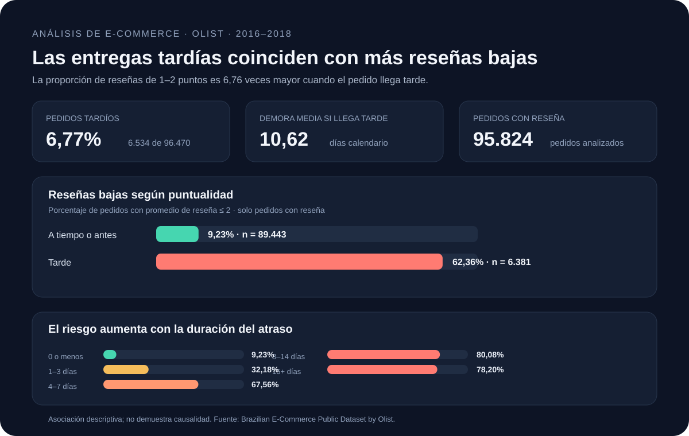

# Olist E-commerce: Delivery Performance & Customer Satisfaction

**A reproducible data analytics portfolio project** exploring how delivery delays relate to customer reviews in Brazil’s Olist marketplace.

[English](#english) · [Español](#espanol)



<a id="english"></a>

## English

### Business question

**What factors are associated with late deliveries and low customer reviews?**

This project analyzes Olist’s historical e-commerce data to measure the relationship between delivery timing and customer ratings, and to identify states, product categories, and months that merit operational review. The analysis is descriptive: it identifies associations and does not establish causation.

### Executive summary

Of **96,470 delivered orders** with complete purchase, estimated-delivery, and actual-delivery dates, **6,534 arrived late (6.77%)**. For orders with a review, the average score was **4.29** for orders delivered on time or early and **2.27** for late orders. The low-review rate was **9.23%** versus **62.36%**, a difference of **53.13 percentage points**.

The low-review rate rose with delay through the 8–14-day band. Late orders averaged **10.62 calendar days** past the estimated delivery date.

### Key findings

| Finding | Result |
|---|---:|
| Delivered orders with complete dates | 96,470 |
| Late orders | 6,534 (6.77%) |
| Average delay among late orders | 10.62 days |
| Average review: on time/early vs. late | 4.29 vs. 2.27 |
| Low-review rate: on time/early vs. late | 9.23% vs. 62.36% |
| Difference in low-review rates | 53.13 percentage points |
| Low-review risk ratio: late vs. on time/early | 6.76× |

**Low review** means an order-level average review score of 2 or less. Reviews are averaged by order when multiple review rows exist.

| Delivery timing | Reviewed orders | Average score | Low-review rate |
|---|---:|---:|---:|
| On time or early | 89,443 | 4.29 | 9.23% |
| 1–3 days late | 1,852 | 3.29 | 32.18% |
| 4–7 days late | 1,748 | 2.11 | 67.56% |
| 8–14 days late | 1,446 | 1.67 | 80.08% |
| 15+ days late | 1,335 | 1.73 | 78.20% |

Other segments to investigate:

- **Destination state:** MA had the highest late rate among states with at least 500 delivered orders (17.43%, 717 orders). RJ had the largest number of late orders (1,495 of 12,350; 12.11%).
- **Product category:** office_furniture had a 21.95% low-review rate among 1,244 reviewed orders, compared with 12.77% overall.
- **Purchase month:** March 2018 had an 18.96% late rate across 7,003 delivered orders.

### Business recommendations

1. Review orders that pass their estimated delivery date, and prioritize investigation or customer outreach once delays reach four days.
2. Break down delivery performance in MA, CE, BA, and RJ by seller and carrier before changing regional operations.
3. Investigate whether low reviews in office_furniture relate to delivery, product damage, packaging, or listing expectations.
4. Validate these patterns with current operational data before applying them to present-day decisions.

### Data and methodology

- **Source:** [Brazilian E-Commerce Public Dataset by Olist](https://www.kaggle.com/datasets/olistbr/brazilian-ecommerce).
- **Period:** historical orders from 2016–2018.
- **Unit of analysis:** one delivered order. Orders without reviews remain in delivery metrics and are excluded from review metrics.
- **Late order:** actual delivery calendar date is later than the estimated delivery calendar date.
- **Low review:** average review score per order is at most 2. An order with multiple review rows contributes its mean score.
- **Late rate:** late delivered orders divided by delivered orders with valid purchase, estimated, and actual delivery dates.
- **Category analysis:** a multi-category order appears once in each category it contains.
- **Quality checks:** 99,441 source orders, 99,224 source review rows, 96,470 delivered orders with complete dates, 95,824 delivered orders with reviews, and 547 orders with multiple review rows.

The dataset is published under the [Creative Commons Attribution-NonCommercial-ShareAlike 4.0 license](https://creativecommons.org/licenses/by-nc-sa/4.0/). Review the source terms before reuse. Raw source files and order-level detail are excluded from this project package; download the data locally using the script below.

### Tools and skills demonstrated

- **SQL / SQLite:** schema design, CSV import, joins, aggregations, views, and business questions.
- **Node.js:** reproducible data preparation and CSV exports using built-in modules.
- **Analytics:** KPI definitions, data-quality checks, segment analysis, and careful interpretation of observational results.
- **Power BI:** dashboard plan, source tables, and DAX examples in [dashboard/guia_power_bi.md](dashboard/guia_power_bi.md). The repository includes a static preview, not a Power BI project file.

### Reproduce the analysis

Requirements: Node.js 18 or later. Run these commands from the project root in PowerShell:

```powershell
node scripts/download_dataset.mjs
Expand-Archive -LiteralPath 'data/raw/olist.zip' -DestinationPath 'data/raw' -Force
node scripts/analyze.mjs
```

The analysis writes aggregate CSV results to data/processed/. The order-level export is generated locally and ignored by Git.

To run the SQL workflow, install the SQLite command-line tool and run each command from the project root:

```powershell
sqlite3 data/processed/olist.db ".read sql/00_schema.sql"
sqlite3 data/processed/olist.db ".read sql/01_import_data.sql"
sqlite3 data/processed/olist.db ".read sql/02_model.sql"
sqlite3 data/processed/olist.db ".read sql/03_business_questions.sql"
```

### Repository structure

```text
.
├── dashboard/       # Power BI guide and static preview
├── data/
│   ├── processed/   # Aggregate analysis outputs
│   └── raw/         # Downloaded source files (ignored by Git)
├── docs/            # Methodology and detailed findings
├── scripts/         # Download and reproducible analysis scripts
├── sql/             # Schema, import, model, and analysis queries
└── README.md
```

### Limitations

The data is historical (2016–2018), and the results may not represent current delivery performance. This is observational data: delivery delay may be associated with lower ratings, but other factors may contribute. Monthly peaks are signals for further investigation, not proof of seasonality or cause. Some product categories are missing or untranslated in the source.

### Detailed project documents

- [Methodology](docs/metodologia.md)
- [Findings and recommendations](docs/hallazgos.md)
- [Power BI dashboard guide](dashboard/guia_power_bi.md)

<hr>

<a id="espanol"></a>

## Español

### Pregunta de negocio

**¿Qué factores se relacionan con las entregas tardías y las evaluaciones bajas de los pedidos?**

Este proyecto analiza datos históricos de comercio electrónico de Olist para medir la relación entre la puntualidad de entrega y las calificaciones, e identificar estados, categorías de producto y meses que ameritan una revisión operativa. El análisis es descriptivo: identifica asociaciones y no demuestra causalidad.

### Resumen ejecutivo

De **96.470 pedidos entregados** con fechas completas de compra, entrega estimada y entrega real, **6.534 llegaron tarde (6,77%)**. Entre pedidos con reseña, la calificación promedio fue **4,29** para entregas puntuales o anticipadas y **2,27** para las tardías. La tasa de reseñas bajas fue **9,23%** frente a **62,36%**, una diferencia de **53,13 puntos porcentuales**.

La tasa de reseñas bajas aumentó junto con la demora hasta el rango de 8–14 días. Los pedidos tardíos tuvieron en promedio **10,62 días calendario** de retraso frente a la fecha estimada.

### Hallazgos principales

| Hallazgo | Resultado |
|---|---:|
| Pedidos entregados con fechas completas | 96.470 |
| Pedidos tardíos | 6.534 (6,77%) |
| Demora promedio entre pedidos tardíos | 10,62 días |
| Calificación promedio: a tiempo/antes vs. tarde | 4,29 vs. 2,27 |
| Tasa de reseña baja: a tiempo/antes vs. tarde | 9,23% vs. 62,36% |
| Diferencia en la tasa de reseña baja | 53,13 puntos porcentuales |
| Razón de riesgo de reseña baja: tarde vs. puntual/anticipado | 6,76× |

**Reseña baja** significa que el promedio de calificación por pedido es menor o igual a 2. Si un pedido tiene varias filas de reseña, se usa el promedio.

| Puntualidad de entrega | Pedidos con reseña | Calificación promedio | Tasa de reseña baja |
|---|---:|---:|---:|
| A tiempo o antes | 89.443 | 4,29 | 9,23% |
| 1–3 días tarde | 1.852 | 3,29 | 32,18% |
| 4–7 días tarde | 1.748 | 2,11 | 67,56% |
| 8–14 días tarde | 1.446 | 1,67 | 80,08% |
| 15 días o más tarde | 1.335 | 1,73 | 78,20% |

Otros segmentos para investigar:

- **Estado de destino:** MA tuvo la mayor tasa tardía entre los estados con al menos 500 pedidos entregados (17,43%, 717 pedidos). RJ tuvo la mayor cantidad de pedidos tardíos (1.495 de 12.350; 12,11%).
- **Categoría de producto:** office_furniture tuvo 21,95% de reseñas bajas entre 1.244 pedidos con reseña, frente a 12,77% general.
- **Mes de compra:** marzo de 2018 registró 18,96% de entregas tardías en 7.003 pedidos entregados.

### Recomendaciones de negocio

1. Revisar los pedidos que superen su fecha estimada de entrega y priorizar la investigación o el contacto con el cliente cuando el retraso llegue a cuatro días.
2. Desglosar el desempeño en MA, CE, BA y RJ por vendedor y transportista antes de cambiar la operación regional.
3. Investigar si las reseñas bajas de office_furniture se relacionan con la entrega, daños, empaque o expectativas creadas por la publicación.
4. Validar estos patrones con datos operativos actuales antes de aplicarlos a decisiones de hoy.

### Datos y metodología

- **Fuente:** [Brazilian E-Commerce Public Dataset by Olist](https://www.kaggle.com/datasets/olistbr/brazilian-ecommerce).
- **Periodo:** pedidos históricos de 2016 a 2018.
- **Unidad de análisis:** un pedido entregado. Los pedidos sin reseña se incluyen en las métricas de entrega y se excluyen de las métricas de satisfacción.
- **Pedido tardío:** la fecha calendario de entrega real es posterior a la fecha calendario estimada.
- **Reseña baja:** promedio de calificación por pedido menor o igual a 2. Si hay varias filas de reseña por pedido, se utiliza su promedio.
- **Tasa tardía:** pedidos entregados tarde divididos por pedidos entregados con fechas válidas de compra, entrega estimada y entrega real.
- **Análisis por categoría:** un pedido con varias categorías aparece una vez en cada categoría que contiene.
- **Controles de calidad:** 99.441 pedidos en la fuente, 99.224 filas de reseña, 96.470 pedidos entregados con fechas completas, 95.824 pedidos entregados con reseña y 547 pedidos con varias filas de reseña.

El conjunto de datos se publica bajo la [licencia Creative Commons Atribución-NoComercial-CompartirIgual 4.0](https://creativecommons.org/licenses/by-nc-sa/4.0/). Revisa las condiciones de la fuente antes de reutilizarlo. El paquete del proyecto no incluye los archivos originales ni el detalle a nivel pedido; puedes descargar los datos localmente con el script siguiente.

### Herramientas y habilidades demostradas

- **SQL / SQLite:** diseño de esquema, importación de CSV, uniones, agregaciones, vistas y consultas de negocio.
- **Node.js:** preparación reproducible de datos y exportación de CSV con módulos integrados.
- **Analítica:** definición de KPI, controles de calidad, análisis por segmentos e interpretación cuidadosa de resultados observacionales.
- **Power BI:** plan del dashboard, tablas fuente y ejemplos DAX en [dashboard/guia_power_bi.md](dashboard/guia_power_bi.md). El repositorio incluye una vista previa estática, no un archivo de Power BI.

### Reproducir el análisis

Requisito: Node.js 18 o posterior. Ejecuta estos comandos desde la raíz del proyecto en PowerShell:

```powershell
node scripts/download_dataset.mjs
Expand-Archive -LiteralPath 'data/raw/olist.zip' -DestinationPath 'data/raw' -Force
node scripts/analyze.mjs
```

El análisis guarda los resultados agregados en CSV dentro de data/processed/. El archivo de detalle por pedido se genera localmente y está excluido de Git.

Para ejecutar el flujo SQL, instala la herramienta de línea de comandos SQLite y ejecuta cada comando desde la raíz del proyecto:

```powershell
sqlite3 data/processed/olist.db ".read sql/00_schema.sql"
sqlite3 data/processed/olist.db ".read sql/01_import_data.sql"
sqlite3 data/processed/olist.db ".read sql/02_model.sql"
sqlite3 data/processed/olist.db ".read sql/03_business_questions.sql"
```

### Estructura del repositorio

```text
.
├── dashboard/       # Guía Power BI y vista previa estática
├── data/
│   ├── processed/   # Resultados agregados del análisis
│   └── raw/         # Archivos descargados (excluidos de Git)
├── docs/            # Metodología y hallazgos detallados
├── scripts/         # Descarga y análisis reproducible
├── sql/             # Esquema, importación, modelo y consultas
└── README.md
```

### Limitaciones

Los datos son históricos (2016–2018) y podrían no representar el desempeño actual de las entregas. La información es observacional: las demoras pueden relacionarse con menores calificaciones, pero podrían intervenir otros factores. Los picos mensuales son señales para investigar, no evidencia de estacionalidad ni de causalidad. Algunas categorías de producto faltan o no tienen traducción en la fuente.

### Documentación del proyecto

- [Metodología](docs/metodologia.md)
- [Hallazgos y recomendaciones](docs/hallazgos.md)
- [Guía del dashboard en Power BI](dashboard/guia_power_bi.md)

